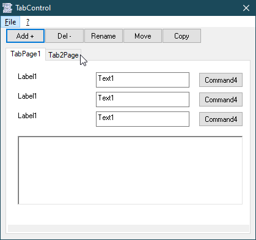

# Ctrl_TabStrip/TabControl  
## Some Classes for a TabControl aka TabStrip aka TabPages   

 

Project started in summer 2006;  
includes the classes: TabControl, TabPage, TabPageCollection, ControlCollection, ISubClass, cSubClass  

